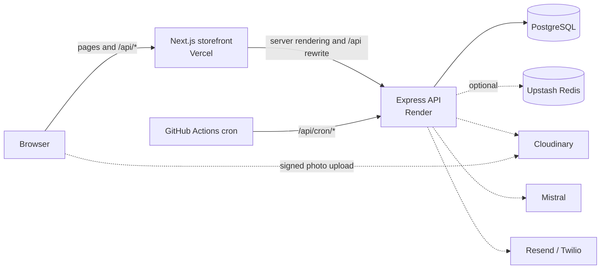
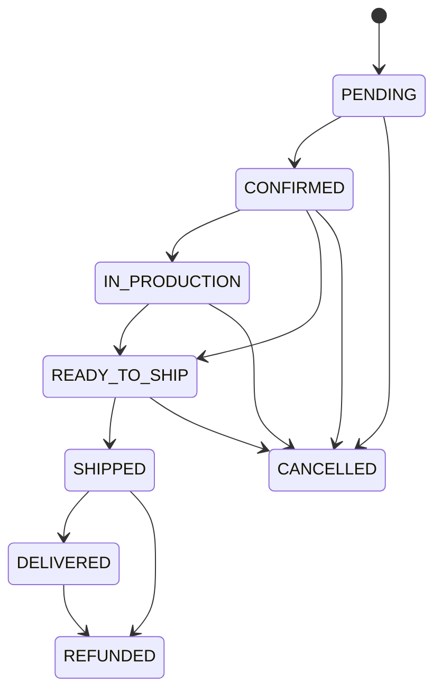

# MomiShop

[](https://github.com/zainabraza06/MamiShop/actions/workflows/ci.yml)

Made-to-measure modest fashion e-commerce for Pakistan. Women's three-piece and
two-piece suits, formals, abayas, stoles, and girls' and boys' wear, with every
stitched garment cut to the customer's own measurements rather than to a size
chart.

- **Storefront:** <https://mami-shop-frontend.vercel.app>
- **API:** <https://momishop-api.onrender.com> (health check at `/api/health`)

The repository holds two services and the logic they share: an **Express API**
(TypeScript, Prisma, PostgreSQL), a **Next.js 16 storefront and admin** (App
Router), and a **shared** workspace with the domain rules both of them apply.

---

## Contents

- [Features](#features)
- [Tech stack](#tech-stack)
- [Architecture](#architecture)
- [Getting started](#getting-started)
- [Environment variables](#environment-variables)
- [Scripts](#scripts)
- [How the main flows work](#how-the-main-flows-work)
- [Roles and permissions](#roles-and-permissions)
- [API overview](#api-overview)
- [Testing](#testing)
- [CI, deployment and scheduled jobs](#ci-deployment-and-scheduled-jobs)
- [Troubleshooting](#troubleshooting)
- [Engineering notes](#engineering-notes)
- [Known gaps](#known-gaps)
- [Further documentation](#further-documentation)

---

## Features

### For shoppers

| Area               | What it does                                                                                                                                                                                  |
| ------------------ | --------------------------------------------------------------------------------------------------------------------------------------------------------------------------------------------- |
| Browsing           | Category tree, search, sorting, cursor-based "load more", new arrivals and featured products on the home page.                                                                                |
| Filters            | Filter by price range, colour, fabric and fit (made to measure or ready-made), plus any custom filters the owner creates. Choices are applied together with an **Apply** button.              |
| Product pages      | Photos, colours and options with live stock, sale prices, reviews and ratings, related products, structured data for search engines, and a true 404 for unknown products.                     |
| Made to measure    | Five measurement templates with plain-language instructions, a measuring guide, inch and centimetre input, and validation that catches impossible combinations. Profiles can be saved.        |
| Cart and checkout  | Guest cart that merges on sign-in, live server-side totals, coupons, shipping zones and rates, inclusive tax, and cash on delivery.                                                           |
| Orders             | Confirmation page that echoes the measurements back, order tracking without an account, and PDF invoices.                                                                                     |
| Accounts           | Email and password or Google sign-in, an account overview, saved pieces (wishlist), a data export and deletion request page, and a sign-out button in the account menu and the mobile menu.   |
| Custom requests    | Signed-in customers describe a piece they want made, attach photos, pick a measurement profile and chat with the shop. The shop replies with a price quote the customer can accept and order. |
| Shopping assistant | An **Ask us** chat button on every storefront page. An AI (Mistral) answers from the live catalogue, stock, delivery rates and policy pages, in English, Urdu or Roman Urdu.                  |
| Accessibility      | Keyboard-operable throughout and checked with axe-core on every key page. See [`docs/ACCESSIBILITY.md`](docs/ACCESSIBILITY.md).                                                               |

### For the shop (admin at `/admin`)

| Section         | What it is for                                                                                                                           |
| --------------- | ---------------------------------------------------------------------------------------------------------------------------------------- |
| Dashboard       | Revenue today, orders needing action, low stock, recent orders.                                                                          |
| Orders          | Search and filter orders, move them through the status flow, add internal notes, and refund.                                             |
| Custom requests | Reply to customers, change a request's status, and send, replace or withdraw price quotes. A badge shows unanswered requests.            |
| Products        | Create and edit products, variants and stock, images (by URL), filter tags, and sales (set a "Was" price; clear it to end the sale).     |
| Filters         | Show, hide and reorder the built-in filters, and create custom ones (for example "Occasion") with their own options.                     |
| Returns         | Review and resolve return requests.                                                                                                      |
| Customers       | Customer list and detail, lifetime value, account status and loyalty adjustments.                                                        |
| Reviews         | Moderate product reviews before they appear.                                                                                             |
| Coupons         | Percentage, fixed-amount or free-shipping coupons with minimum spend, caps, usage limits, product or category rules and date windows.    |
| Content         | The announcement bar, the home page hero, and policy pages such as returns and privacy.                                                  |
| Reports         | Daily revenue chart over a chosen range (Pakistan time) and a CSV export of orders without personal data.                                |
| Staff           | Invite staff, change roles and permissions, reset passwords. Guards stop anyone granting more than they have or removing the last owner. |
| Audit log       | A read-only record of who changed what, and when.                                                                                        |
| Settings        | Shipping zones, rates and delivery times, cash on delivery charges, and tax rules.                                                       |

The sidebar only shows the sections the signed-in staff member is allowed to use.

---

## Tech stack

| Layer            | Technology                                                                                         |
| ---------------- | -------------------------------------------------------------------------------------------------- |
| Storefront       | Next.js 16 (App Router), React 19, Tailwind CSS 3, Radix UI, react-hook-form, sonner, lucide-react |
| API              | Node 20+, Express 5, Zod, jose (JWT sessions), bcryptjs                                            |
| Database         | PostgreSQL 16 with Prisma 6                                                                        |
| Shared logic     | TypeScript workspace `@momishop/shared`, imported by both services                                 |
| Cache and limits | Upstash Redis (optional; falls back to in-memory)                                                  |
| Media            | Cloudinary (signed browser uploads for custom requests)                                            |
| AI assistant     | Mistral (`@mistralai/mistralai`), Ministral models with automatic fallback                         |
| Email and SMS    | Resend, Twilio (both optional; they log instead of sending when unset)                             |
| Documents        | pdf-lib for invoices                                                                               |
| Testing          | Vitest, Supertest, Playwright, axe-core                                                            |
| Tooling          | npm workspaces, tsup, ESLint 9 (flat config), Prettier                                             |
| Hosting          | Vercel (storefront), Render (API and Postgres, Singapore region), GitHub Actions (CI and cron)     |

---

## Architecture



### Repository layout

```
shared/          @momishop/shared: pure domain logic and the API contract
  src/           money, pricing, coupons, shipping, measurements, validation,
                 rbac, order-status, api-types, session-contract

backend/         @momishop/backend: the Express API
  src/
    routes/      One file per area: catalogue, cart, checkout, orders, auth,
                 account, custom-requests, uploads, assistant, admin-*, cron
    services/    Catalogue, cart, checkout, orders, custom requests and quotes,
                 assistant, jobs, email, SMS, invoices, audit, content
    auth/        Sessions, password and Google sign-in, live-row guards
    http/        Error mapping, validation, rate limiting, CSRF guard
    lib/         Prisma client, Redis, cache, logger, crypto, env
  prisma/        Schema, migrations, seed
  tests/         API tests (Supertest against the real app, database mocked)

frontend/        @momishop/frontend: the Next.js storefront and admin
  src/
    app/         Routes: (storefront), account, admin, checkout, products...
    components/  UI kit, product, cart, checkout, measurement form, chat,
                 account, assistant, admin
    lib/         API client, formatting, Pakistan-time helpers
    proxy.ts     Session-aware redirects
  tests/e2e/     Playwright: the critical path and an axe audit

docs/            Architecture, deployment, security, accessibility, operations
scripts/         Dev runner and env loading shared by both services
render.yaml      Render blueprint for the API and its database
```

### Why two services

The storefront renders and the API decides. Splitting them means the browser
bundle cannot import a module that reaches the database, the API can be scaled
or deployed on its own, and the same API can serve a mobile app later without
going through Next. The cost is a network hop and two deploy targets, repaid by
a boundary the module graph enforces rather than discipline.

### Layering rule

`shared/**` is pure: no database, no network, no clock. Pricing, coupon
eligibility, measurement validation, shipping-zone resolution and the order
state machine take their inputs as arguments. That makes them exhaustively
testable, and it is why the checkout endpoint and the browser compute
identical totals from identical inputs.

`backend/src/services/**` owns I/O (Prisma, transactions, email, PDF, jobs,
third-party APIs). `frontend/**` owns rendering and reaches data only through
the API.

### How the storefront talks to the API

Server components call the API directly through
[`frontend/src/lib/api.ts`](frontend/src/lib/api.ts), forwarding the visitor's
cookies so the API sees the request as it would from the browser. The browser
calls `/api/*` on the storefront's own origin, which Next rewrites to the API.
Session and cart cookies therefore stay first-party, `SameSite=Lax` protects
them, and no CORS is involved.

### Money and time

- Every amount is an **integer in minor units** (paisa). Floating point is never
  used for money. [`shared/src/money.ts`](shared/src/money.ts) has the
  arithmetic, including `allocate()`, which splits a discount across lines
  without losing or inventing a paisa.
- Business days and reports use **Pakistan time** (`Asia/Karachi`, UTC+5, no
  daylight saving), so "today's revenue" means the shop's today.

### Two-layer authorisation

The API issues a session as a signed JWT in an httpOnly cookie.
`frontend/src/proxy.ts` reads it for a fast redirect; the API's
`requireStaff()` and `requirePermission()` **decide**, by re-reading the live
user row. A token carries the role as of sign-in, so a staff member demoted five
minutes ago still presents their old role; the live check is what stops them.

### Background work

A transactional outbox, not an in-memory queue. Jobs are rows written in the
**same transaction** as the business change and drained by `/api/cron/jobs`.
An order can never commit without its confirmation email being queued, and a
rolled-back order can never send one. Workers claim batches with
`FOR UPDATE SKIP LOCKED`, so overlapping cron runs never double-send. Delivery
is at-least-once, so **every handler must be idempotent**.

---

## Getting started

### Prerequisites

- Node.js 20 or newer, and npm
- Docker (for local PostgreSQL), or any PostgreSQL 16 you can reach

### Run it locally

```bash
# 1. Install dependencies (one install covers all three workspaces)
npm install

# 2. Create your environment file. Only DATABASE_URL and AUTH_SECRET are
#    required to boot; every integration degrades gracefully without its key.
#    Both services read this one file.
cp .env.example .env

# 3. Start PostgreSQL (Redis is optional)
docker compose up -d postgres

# 4. Create the schema and load sample data
npm run db:migrate
npm run db:seed

# 5. Run the API and the storefront together
npm run dev
```

Open <http://localhost:3000>. The API runs on <http://localhost:4000>, but the
storefront proxies `/api/*` to it, so the storefront is the only address you
need.

Generate a real `AUTH_SECRET` with `openssl rand -base64 32`. It belongs to the
API alone; the storefront holds no secrets.

### Seeded accounts (local development only)

| Role                | Email                | Password         |
| ------------------- | -------------------- | ---------------- |
| Owner (super admin) | `admin@momishop.pk`  | `ChangeMe!2024`  |
| Staff               | `staff@momishop.pk`  | `StaffPass!2024` |
| Customer            | `ayesha@example.com` | `Customer!2024`  |

> **These passwords are public.** If you seed a staging or production database,
> change the owner password straight away (set `SEED_ADMIN_EMAIL` and
> `SEED_ADMIN_PASSWORD` before seeding) and suspend or delete the staff and
> customer test accounts from **Admin → Staff** and **Admin → Customers**.

---

## Environment variables

[`.env.example`](.env.example) is the full, commented list. Everything is
validated at boot by [`backend/src/lib/env.ts`](backend/src/lib/env.ts).

### API (Render, or `.env` locally)

| Variable                                                               | Required | Purpose, and what happens without it                                                                         |
| ---------------------------------------------------------------------- | -------- | ------------------------------------------------------------------------------------------------------------ |
| `DATABASE_URL`                                                         | Yes      | PostgreSQL connection used by the running API.                                                               |
| `DIRECT_URL`                                                           | Hosted   | Direct (non-pooled) connection for `prisma migrate`.                                                         |
| `AUTH_SECRET`                                                          | Yes      | Signs session tokens. At least 32 characters.                                                                |
| `APP_URL`                                                              | Yes      | Public storefront URL, used in email links and sign-in redirects.                                            |
| `API_PUBLIC_URL`                                                       | Optional | Public API URL for the Google sign-in callback. Defaults to `APP_URL`.                                       |
| `TRUST_PROXY`                                                          | Hosted   | Proxy hops, so client IPs and rate limits are correct behind a load balancer.                                |
| `CORS_ORIGINS`                                                         | Optional | Only if a browser calls the API on its own domain. Not needed through the storefront.                        |
| `CRON_SECRET`                                                          | Hosted   | Protects `/api/cron/*`. Must match the GitHub Actions secret.                                                |
| `AUTH_GOOGLE_ID`, `AUTH_GOOGLE_SECRET`                                 | Optional | Google sign-in. The button is always shown, but it only works when these are set.                            |
| `UPSTASH_REDIS_REST_URL`, `UPSTASH_REDIS_REST_TOKEN`                   | Optional | Shared cache and rate limits. Without them each API instance keeps its own in memory.                        |
| `CLOUDINARY_CLOUD_NAME`, `CLOUDINARY_API_KEY`, `CLOUDINARY_API_SECRET` | Optional | Photo uploads in custom requests. Without them the upload button is hidden. The key needs upload permission. |
| `MISTRAL_API_KEY`                                                      | Optional | The shopping assistant. Without it the chat button is hidden.                                                |
| `MISTRAL_MODEL`                                                        | Optional | A model to try first. Otherwise `ministral-14b-latest`, then `ministral-8b-latest`.                          |
| `RESEND_API_KEY`, `EMAIL_FROM`, `EMAIL_REPLY_TO`                       | Optional | Transactional email. Without a key, emails are logged instead of sent.                                       |
| `TWILIO_ACCOUNT_SID`, `TWILIO_AUTH_TOKEN`, `TWILIO_FROM_NUMBER`        | Optional | SMS. Without them, messages are logged instead of sent.                                                      |
| `ENABLE_LOYALTY`, `ENABLE_REVIEWS`, `ENABLE_GUEST_CHECKOUT`            | Optional | Feature flags. The storefront's `NEXT_PUBLIC_ENABLE_*` values are used when these are unset.                 |
| `LOG_LEVEL`                                                            | Optional | `debug`, `info` (default), `warn` or `error`.                                                                |

### Storefront (Vercel)

| Variable                                                     | Purpose                                                         |
| ------------------------------------------------------------ | --------------------------------------------------------------- |
| `API_URL`                                                    | Where the storefront's server reaches the API (the Render URL). |
| `NEXT_PUBLIC_APP_URL`, `NEXT_PUBLIC_APP_NAME`                | Public URL and name used in metadata and links.                 |
| `NEXT_PUBLIC_DEFAULT_CURRENCY`, `NEXT_PUBLIC_DEFAULT_LOCALE` | `PKR` and `en-PK`.                                              |
| `NEXT_PUBLIC_ENABLE_*`                                       | Feature flags shown in the storefront.                          |

The storefront holds **no secrets**. Never put an API key in a `NEXT_PUBLIC_*`
variable: those are bundled into the browser.

---

## Scripts

Run from the repository root. Workspace-specific commands also work with
`-w @momishop/backend` (or `@momishop/frontend`, `@momishop/shared`).

| Command                  | What it does                                          |
| ------------------------ | ----------------------------------------------------- |
| `npm run dev`            | API and storefront together, with prefixed output     |
| `npm run dev:api`        | API only                                              |
| `npm run dev:web`        | Storefront only                                       |
| `npm run build`          | Build both services                                   |
| `npm run build:api`      | Bundle the API with tsup                              |
| `npm run typecheck`      | `tsc --noEmit` in every workspace                     |
| `npm run lint`           | ESLint across the repository                          |
| `npm run format`         | Prettier write                                        |
| `npm run format:check`   | Prettier check (CI fails on unformatted files)        |
| `npm test`               | Unit and API tests in every workspace                 |
| `npm run test:coverage`  | Tests with per-workspace coverage thresholds          |
| `npm run test:e2e`       | Playwright: starts both services and drives a browser |
| `npm run db:migrate`     | Create and apply a migration (development)            |
| `npm run db:deploy`      | Apply pending migrations (CI and production)          |
| `npm run db:seed`        | Idempotent seed                                       |
| `npm run db:studio`      | Prisma Studio                                         |
| `npm run db:reset`       | Drop, re-migrate and re-seed the local database       |
| `npm run db:check-drift` | Fail if the schema has drifted from its migrations    |

---

## How the main flows work

### Made to measure

There are no sizes. A customer enters their own measurements, which are
validated against a garment template and **frozen onto the order line** at
purchase. Editing a saved profile later can never change a garment already
being cut.

[`shared/src/measurements.ts`](shared/src/measurements.ts) defines five
templates (`WOMENS_STITCHED`, `GIRLS_STITCHED`, `BOYS_STITCHED`, `ABAYA`,
`STOLE`), each with plausible ranges per field, plain-language instructions,
inch and centimetre conversion, and cross-field checks that catch mistakes a
per-field range cannot, such as a sleeve longer than the shirt it attaches to.
The browser and the API apply exactly the same rules.

### Order lifecycle



Staff change an order's status from **Admin → Orders → (order)**, which only
offers the moves allowed from its current status
([`shared/src/order-status.ts`](shared/src/order-status.ts)). Placing an order
reserves stock, applies the coupon, records loyalty, clears the cart and
queues the confirmation email in **one transaction**.

### Custom requests and quotes

1. A signed-in customer opens **Account → Custom requests → New**, describes the
   piece, optionally attaches photos (uploaded straight to Cloudinary with a
   signature from the API) and a measurement profile.
2. The customer and the shop chat on the request page. New messages appear
   within a few seconds.
3. Staff send a **quote** (price, stitching days, how long it is valid). Sending
   a new quote replaces the open one; staff can also withdraw it.
4. The customer accepts it on its own checkout page (address, delivery, cash on
   delivery or bank transfer) and it becomes a normal order, with the
   measurements frozen, or declines it and keeps talking.

The API only accepts photos from the shop's own Cloudinary folder, and a quote
can be accepted once: two simultaneous accepts cannot create two orders.

### Shopping assistant

The **Ask us** button calls `POST /api/assistant/chat`. The API asks a Mistral
model to answer using read-only tools:

| Tool                   | What it reads                                                         |
| ---------------------- | --------------------------------------------------------------------- |
| `search_products`      | Products for sale, with price, sale price, colours, stock and fabric. |
| `get_product`          | One product's full details and every option's stock.                  |
| `list_categories`      | Categories and product counts.                                        |
| `get_shop_policies`    | Delivery zones, rates and times, and the published policy pages.      |
| `offer_custom_request` | Shows a "Request a custom piece" button when nothing fits.            |

Products the reply names appear as cards under it. The assistant cannot see
accounts, orders or unpublished products, the conversation lives only in the
visitor's browser tab, and each visitor is limited to 20 questions per 10
minutes. If Mistral rate limits a model, the API switches to the next one and
skips the limited model for a minute. Code:
[`backend/src/services/assistant.ts`](backend/src/services/assistant.ts).

### Sales, coupons and filters

- **Sale:** in **Admin → Products → (product)**, set the "Was" price above the
  price. The storefront shows both. Clear "Was" to end the sale.
- **Coupons:** **Admin → Coupons**. A coupon can take a percentage off (with an
  optional maximum), a fixed amount off, or make delivery free. It can require a
  minimum spend, be limited overall and per customer, apply only to certain
  products or categories or to a customer's first order, and run between a start
  and end date. Paused or expired coupons are refused at checkout.
- **Filters:** **Admin → Filters** controls the storefront filter panel. Tag
  products with custom filter options in the product editor.

---

## Roles and permissions

Defined in [`shared/src/rbac.ts`](shared/src/rbac.ts) and enforced by the API on
every admin request.

| Role          | Can do                                                                                                                                              |
| ------------- | --------------------------------------------------------------------------------------------------------------------------------------------------- |
| `CUSTOMER`    | Shop, check out, manage their own account and custom requests.                                                                                      |
| `STAFF`       | View products and coupons; manage orders, stock, returns, reviews and custom request conversations; view customers and reports. Cannot send quotes. |
| `ADMIN`       | Everything staff can, plus products, categories, filters, refunds, cancellations, quotes, customers, coupons, content, settings and more.           |
| `SUPER_ADMIN` | Everything, including staff management. The last super admin cannot be removed or demoted.                                                          |

Individual permissions can be granted on top of a role from **Admin → Staff**.
Nobody can grant a permission they do not hold themselves. Staff names are never
shown to customers; replies appear as the shop.

---

## API overview

All endpoints are under `/api`. Write requests from browsers must come from the
storefront's origin. Errors return `{ "error": "...", "code": "..." }` with a
suitable status, and validation errors (422) include `issues`.

| Area            | Endpoints                                                                                                                                                                                                                                                                               |
| --------------- | --------------------------------------------------------------------------------------------------------------------------------------------------------------------------------------------------------------------------------------------------------------------------------------- |
| Health          | `GET /health`                                                                                                                                                                                                                                                                           |
| Storefront      | `GET /storefront/shell`, `GET /storefront/home`, `GET /pages/:slug`                                                                                                                                                                                                                     |
| Catalogue       | `GET /categories`, `GET /categories/:slug`, `GET /products`, `GET /products/facets`, `GET /products/:slug`, `GET /products/:productId/reviews`                                                                                                                                          |
| Cart            | `GET /cart`, `POST` / `PATCH` / `DELETE /cart/items`                                                                                                                                                                                                                                    |
| Checkout        | `GET /checkout/context`, `POST /checkout/quote`, `POST /checkout`                                                                                                                                                                                                                       |
| Orders          | `GET /orders/track`, `GET /orders/:orderNumber`, `GET /orders/:orderNumber/invoice`                                                                                                                                                                                                     |
| Auth            | `POST /auth/register`, `POST /auth/login`, `POST /auth/logout`, `GET /auth/session`, `GET /auth/google`, `GET /auth/google/callback`                                                                                                                                                    |
| Account         | `GET /account/overview`, `GET` / `POST /account/data-requests`, `GET` / `POST /wishlist`, `DELETE /wishlist/:productId`                                                                                                                                                                 |
| Custom requests | `GET /custom-requests/options`, `GET` / `POST /custom-requests`, `GET /custom-requests/:id`, `GET` / `POST /custom-requests/:id/messages`, and `/custom-requests/:id/quotes/:quoteId/checkout`, `preview`, `accept`, `decline`                                                          |
| Uploads         | `POST /uploads/signature`                                                                                                                                                                                                                                                               |
| Assistant       | `GET /assistant/status`, `POST /assistant/chat`                                                                                                                                                                                                                                         |
| Contact         | `POST /contact`, `POST /newsletter`                                                                                                                                                                                                                                                     |
| Admin           | `/admin/shell`, `dashboard`, `orders`, `custom-requests`, `products`, `variants`, `categories`, `filters`, `filter-options`, `returns`, `customers`, `reviews`, `coupons`, `content`, `pages`, `reports`, `staff`, `audit`, `settings`, `shipping-zones`, `shipping-rates`, `tax-rules` |
| Cron            | `/cron/jobs`, `/cron/abandoned-carts` (require `CRON_SECRET`)                                                                                                                                                                                                                           |

Browse the route files in [`backend/src/routes/`](backend/src/routes) for
request and response details; shapes are typed in
[`shared/src/api-types.ts`](shared/src/api-types.ts) and validated by
[`shared/src/validation.ts`](shared/src/validation.ts).

---

## Testing

```bash
npm test               # shared, API and storefront unit tests
npm run test:e2e       # Playwright critical path and accessibility audit
```

| Suite                        | Where                          | Size                  |
| ---------------------------- | ------------------------------ | --------------------- |
| Domain logic                 | `shared/src/**/*.test.ts`      | 245 tests in 12 files |
| API                          | `backend/tests/*.test.ts`      | 298 tests in 27 files |
| Storefront units             | `frontend/src/**/*.test.ts`    | 2 tests               |
| End to end and accessibility | `frontend/tests/e2e/*.spec.ts` | Chromium and mobile   |

- **API tests** drive the real Express app through Supertest with Prisma mocked,
  so they need no database. External services (Mistral, Cloudinary) are replaced
  with fakes.
- **End-to-end tests** run against real builds of both services and a seeded
  database. They assert status codes and accessible names, not CSS classes.
- **Accessibility:** `accessibility.spec.ts` runs axe-core on every key page.
  Axe catches roughly a third of WCAG issues, so keyboard tests sit alongside it.

Running a subset of end-to-end tests on Windows: run from `frontend`, and avoid
spaces and `|` in the pattern (use `.` instead):

```bash
cd frontend
node ../scripts/with-env.mjs npx playwright test --grep cash-on-delivery
```

---

## CI, deployment and scheduled jobs

### Continuous integration

[`.github/workflows/ci.yml`](.github/workflows/ci.yml) runs on every push and
pull request:

| Job                          | Checks                                                                               |
| ---------------------------- | ------------------------------------------------------------------------------------ |
| Lint, format and types       | `npm run typecheck`, `npm run build:api`, `npm run lint`, `npm run format:check`     |
| Unit and integration tests   | `npm run test:coverage`                                                              |
| End-to-end and accessibility | Migrates and seeds a Postgres service, builds both apps, runs Playwright on Chromium |
| Migration integrity          | Replays every migration and fails if the schema has drifted                          |
| Dependency audit             | `npm audit --audit-level=high`                                                       |

Run `npm run format` before pushing: unformatted files fail the first job.

### Deploying

| Service    | Host   | How it deploys                                                                                                                  |
| ---------- | ------ | ------------------------------------------------------------------------------------------------------------------------------- |
| Storefront | Vercel | Automatically on every push to `main` (project root directory `frontend`).                                                      |
| API        | Render | `autoDeploy` is off. Deploy from the Render dashboard (**Manual Deploy → Deploy latest commit**) or the deploy workflow's hook. |
| Database   | Render | PostgreSQL 16, created by [`render.yaml`](render.yaml).                                                                         |

Rules that keep deploys safe:

1. **Migrations run before the new code goes live.** Every migration must work
   with the previous release (expand, then contract). Apply them with
   `npm run db:deploy` against the production database.
2. **Deploy the API first, then the storefront.** A new storefront page may call
   an endpoint the old API does not have; that shows up as a 404 in the admin or
   storefront until the API is deployed.
3. **Keep both in the same region** (Singapore). The storefront calls the API on
   every page render.

The full runbook, including rollback and backups, is in
[`docs/DEPLOYMENT.md`](docs/DEPLOYMENT.md).

### Production checklist

- [ ] `AUTH_SECRET`, `CRON_SECRET`, `APP_URL`, `DATABASE_URL`, `DIRECT_URL` and
      `TRUST_PROXY` set on Render
- [ ] `API_URL` and the `NEXT_PUBLIC_*` values set on Vercel
- [ ] Migrations applied (`npm run db:deploy`)
- [ ] Seeded owner password changed; staff and customer test accounts suspended
- [ ] Cloudinary key has upload permission (for custom request photos)
- [ ] `MISTRAL_API_KEY` set if the assistant should be visible
- [ ] Resend and Twilio keys set if emails and SMS should actually send
- [ ] `CRON_SECRET` and the API URL added as GitHub Actions secrets for cron

### Scheduled jobs

[`.github/workflows/cron.yml`](.github/workflows/cron.yml) calls the API on a
schedule (GitHub Actions allows five-minute intervals for free):

| Schedule        | Endpoint                    | Does                                     |
| --------------- | --------------------------- | ---------------------------------------- |
| Every 5 minutes | `/api/cron/jobs`            | Drains the outbox: emails, SMS, and more |
| Every 3 hours   | `/api/cron/abandoned-carts` | Queues abandoned-cart reminders          |

Either can be run by hand from the workflow's **Run workflow** button.

---

## Troubleshooting

| Symptom                                                                                     | Cause and fix                                                                                                                                                                                                |
| ------------------------------------------------------------------------------------------- | ------------------------------------------------------------------------------------------------------------------------------------------------------------------------------------------------------------ |
| Admin or storefront page shows **404** right after a push                                   | Vercel deployed the new storefront but the API on Render has not been deployed. Deploy the API (**Manual Deploy → Deploy latest commit**).                                                                   |
| Photo upload fails with `Request forbidden due to missing permissions (actions=["create"])` | The Cloudinary API key is restricted. In Cloudinary **Settings → API Keys**, use a key with upload permission, update `CLOUDINARY_API_KEY` and `CLOUDINARY_API_SECRET` on Render, and redeploy.              |
| No **Ask us** button                                                                        | `MISTRAL_API_KEY` is not set on the API, or the API has not been redeployed since it was added.                                                                                                              |
| Assistant says **"The assistant is busy right now"**                                        | Mistral returned 429 for every model tried. Check Render logs for `Mistral rate limited the assistant`; its `body` gives the reason. Free-tier accounts may refuse some models entirely, or be out of quota. |
| Log warning that Redis is not configured                                                    | Expected without Upstash. Rate limits and cache fall back to memory, which is fine on a single API instance.                                                                                                 |
| Emails or SMS never arrive                                                                  | Without `RESEND_API_KEY` or Twilio keys they are logged, not sent. Also confirm the cron workflow is running, since the outbox sends them.                                                                   |
| CI fails on **Check formatting**                                                            | Run `npm run format` and commit the result.                                                                                                                                                                  |
| Sign-in works locally but not in production                                                 | `APP_URL` must be the storefront's `https://` URL; secure cookies depend on it.                                                                                                                              |

---

## Engineering notes

Worth reading before changing the code.

- **`products/(list)/loading.tsx` placement is load-bearing.** A `loading.tsx`
  directly in `products/` would wrap the product page in the same Suspense
  boundary, Next would flush a 200 before reaching `notFound()`, and every dead
  product URL would answer 200 with 404 content (a soft 404 search engines
  index). The route group scopes the loading state to the listing.
- **Cart lines are compared by measurement content, not key order.** Postgres
  `jsonb` does not preserve key order, so comparing JSON strings created
  duplicate lines. See [`shared/src/canonical-json.ts`](shared/src/canonical-json.ts).
- **Order items snapshot everything.** Name, price, image and measurements are
  copied onto the order line, so an old invoice renders the same after the
  product is edited or archived.
- **A new cart always gets a fresh token**, otherwise it collides with the
  converted cart after checkout.
- **Dates rendered on the server use Pakistan time helpers**
  ([`frontend/src/lib/shop-time.ts`](frontend/src/lib/shop-time.ts)) so server
  and browser render identical markup.
- **The storefront's mobile menu renders in a portal** with a measured top
  offset, so the header's overflow and stacking cannot squash it or swallow taps
  on its links. It also closes on any link tap, because category links differ
  only in their query string and would not trigger a route change.
- **The Mistral SDK is ESM-only**, so tsup bundles it into the CommonJS API build
  alongside `jose` ([`backend/tsup.config.ts`](backend/tsup.config.ts)).

---

## Known gaps

- **Card and wallet payments.** Cash on delivery works end to end, and bank
  transfer is offered when accepting a custom quote. Stripe, JazzCash and
  Easypaisa are modelled and accepted by checkout, but their payment adapters
  and webhooks are not built, so do not enable them for customers yet.
- **Product photos** are added by URL in the admin; direct uploads exist only for
  custom request photos.
- **Custom request chat** refreshes by polling every few seconds rather than a
  live connection.

---

## Further documentation

| Document                                           | Covers                                                                       |
| -------------------------------------------------- | ---------------------------------------------------------------------------- |
| [`docs/ARCHITECTURE.md`](docs/ARCHITECTURE.md)     | Data model, request flow, design decisions                                   |
| [`docs/DEPLOYMENT.md`](docs/DEPLOYMENT.md)         | Environments, migrations, rollback, backups                                  |
| [`docs/SECURITY.md`](docs/SECURITY.md)             | Threat model and every control, with rationale                               |
| [`docs/ACCESSIBILITY.md`](docs/ACCESSIBILITY.md)   | WCAG AA commitments and how they are tested                                  |
| [`docs/OPERATIONS.md`](docs/OPERATIONS.md)         | Monitoring, jobs, load testing, runbooks                                     |
| [`docs/DATA_RETENTION.md`](docs/DATA_RETENTION.md) | Retention policy and data export or deletion requests                        |
| [`docs/ROADMAP.md`](docs/ROADMAP.md)               | Earlier status notes; parts predate the admin, custom requests and assistant |
